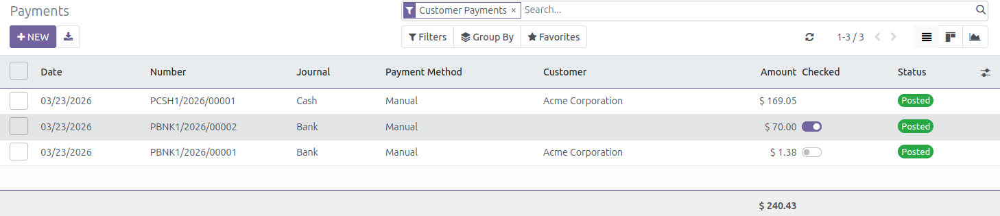
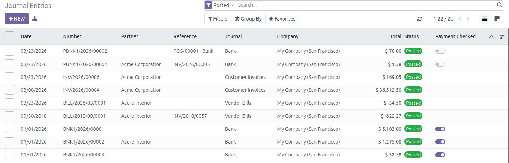

This module extends the functionality of Accounting module to add a new
field on account moves `is_payment_checked` (journal entry) and
account payment `is_checked`

When payment moves are generated by users that don't belong to the group
"Account manager" `account.group_account_manager`, the journal entry will
be marked as to be verified if:

* journal is type of 'bank'

* payment is type 'outbound' or 'inbound'

The accountant, can then mark the payment as verified, it will mark
the journal entry as marked.

