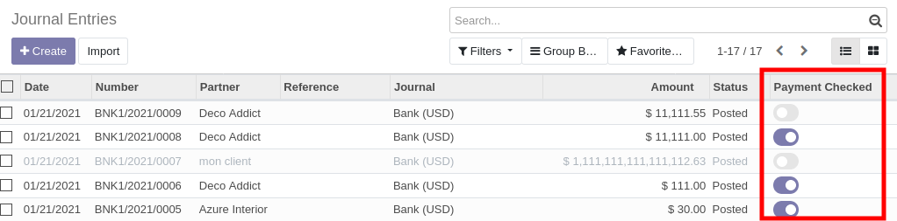

This module extends the functionality of Accounting module
to add a new field on account moves ``is_payment_checked``.

When payment moves are generated by users that don't belong to the group
"Account manager" ``account.group_account_manager``, the account move
will be marked as to be verified.

The accountant, can then mark the payment as verified.

